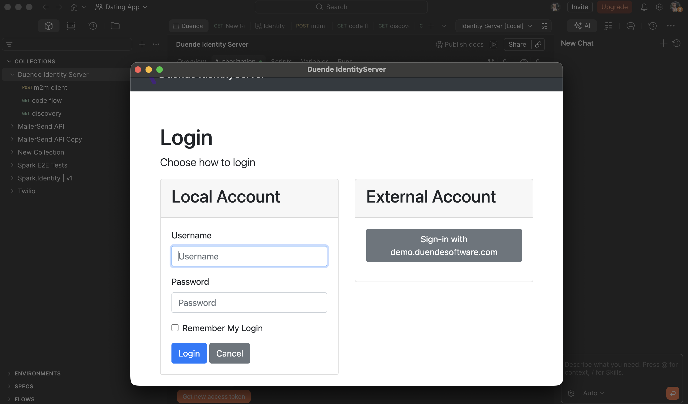

# 1. Seed the database

change directory to the same level as program.cs
run the following 

```
dotnet run /seed 
```

This will seed the database and then exit the program.

# 2. Authenticate with PKCE (Mobile flow)

There is a postman collection with the authorisation step that simulated a mobile device login. This is defined in Client.cs as the 'interactive' flow, this is how mobile clients can use the built in browser to go to the Identity Server login page and users may then authenticate themselves. Mobile frameworks often have OpenID capable packages that can make this OAuth flow easier to integrate. This flow does not require a client secret - this is okay for machine-to-machine (aka m2m) transactions but for public clients such as mobiles, these should not store the client secret as the binary can be reverse engineered via a decompiler.

_interactive snippet_
```
new Client
    {
        ClientId = "interactive",
        // treat as a public PKCE client (no client secret) so Postman and native apps can use PKCE
        RequirePkce = true,
        RequireClientSecret = false,
        AllowedGrantTypes = GrantTypes.Code,
        RedirectUris = 
        {
            "https://localhost:44300/signin-oidc",
            "https://oauth.pstmn.io/v1/callback"
        },
        FrontChannelLogoutUri = "https://localhost:44300/signout-oidc",
        PostLogoutRedirectUris = { "https://localhost:44300/signout-callback-oidc" },

        AllowOfflineAccess = true,
        AllowedScopes = { "openid", "profile", "scope2" },
        AllowedCorsOrigins = 
        {
            "https://localhost:44300",
            "https://localhost:5001",
            "https://oauth.pstmn.io"
        }
    },
```

The repo includes a Postman collection and environemtn in the root folder _postman_.

Import this and the environment provided and then navigate to the authorization tab:


When clicking on *Get new access token* this will load a web browser


Now if you type the credentials of Alice - this account was seeded in step #1, you will be logged in with a session.
